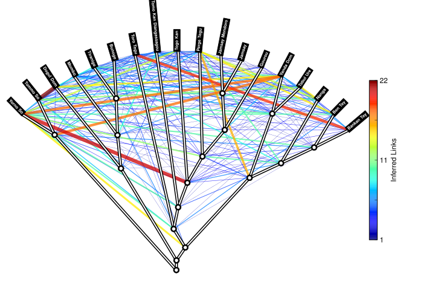

================
Workflow Example
================

This is an example workflow that illustrates some of the functionality of LingPy. We start with a
small dataset from the Dogon Languages Project and we lead users through the stages of a typical
automatic analysis.

More about the Dogon languages and the full dataset are available from:

* http://www.dogonlanguages.org

Getting Started
===============

First, make sure to have the LingPy library installed properly; see the :ref:`Installation Instructions`
for details. The dataset that will be used can be downloaded from the following link:

* http://www.lingpy.org/download/workflow.zip

This folder also includes a Python script that runs the whole code from the beginning to the end.
In order to start the analysis, unzip the dataset and cd into that folder. Then load the LingPy
library::

  >>> from lingpy import *

Then load the dataset into a :py:class:`~lingpy.basic.wordlist.Wordlist` object by typing::
  
  >>> wl = Wordlist('DOGON.qlc')

This will load the wordlist. You can check for some specific characteristics, such as the number
of languages (the 'width' of the Wordlist) or the number of concepts (its 'height')::

  >>> wl.width
  18
  >>> wl.height
  325

Orthographic Parsing
====================

Orthographic parsing is the first step in preparing the data. For the analyses in this workflow, an IPA format of tokenized sequences is needed. In order to get the IPA tokens from the raw data, we need an orthography profile that describes the Unicode character sequences in the raw data and their IPA equivalents.
This has already been prepared. It is stored in the file Heath2013.prf_. In order to parse the data,
type in the following::

  >>> wl.tokenize(ortho_profile='Heath2013.prf')

As a result, LingPy will iterate over all words in the dataset and convert them to IPA, as specified
in the orthography profile. We can now write the data to an output file so that we can use it in the next
step of the workflow::

  >>> wl.output('qlc',filename='DOGON_tokens')

This function writes the data to the file DOGON_tokens.qlc_

.. _Automatic Cognate Detection:

Automatic Cognate Detection
===========================

Automatic cognate detection in LingPy is basically carried out with help of the
:py:class:`~lingpy.compare.lexstat.LexStat` class. All classes that inherit from the :py:class:`~lingpy.basic.wordlist.Wordlist` 
class take a filename as parameter::

  >>> lex = LexStat('DOGON_tokens.qlc')

Once instantiated, a :py:class:`~lingpy.compare.lexstat.LexStat` object offers all methods and
attributes that are also defined for a :py:class:`~lingpy.basic.wordlist.Wordlist` object::

  >>> lex.width
  18
  >>> lex.height
  325

In order to carry out a cognate detection analysis using the LexStat method (see :evobib:`List2012b`), we first have to 
create a scoring dictionary from automatically identified sound correspondences. There are a lot of
different parameters for this analysis, but for now, the defaults will suffice, so we can call
this method by simply typing::

  >>> lex.get_scorer()

This preprocessing stage is computationally-intensive and make take some time to run the calculations. Therefore it is useful to store the current state before moving on to the next step in the analysis::

  >>> lex.pickle()

Now, we can carry out the cognate detection. This is a cluster method that clusters all sequences, which are similar to each other, into the same cognate set. Which sequences are clustered depends on a threshold that we have to pass as an argument to the function. Here we chosen 0.5 as a threshold (see :evobib:`List2012c` for a detailed description of the LexStat algorithm). This is a rather conservative score, which avoids generating too many false positives::

  >>> lex.cluster(method='lexstat',threshold=0.5)

Having calculated the cognates, we can go on and calculate a tree. Here we use the
:py:func:`lingpy.basic.wordlist.Wordlist.calculate` function. We've chosen 'neighbor' (see
:evobib:`Saitou1987`) as the algorithm for the tree-calculation, and we must define 'lexstatid' as
the column where the cognate IDs are stored::

  >>> lex.calculate('tree',ref='lexstatid',tree_calc='neighbor')

As a result, the :py:class:`~lingpy.compare.lexstat.LexStat` object gets a **tree** attribute. This
is again is a specific class taken from the PyCogent library (see http://pycogent.org/). It can be
visualized as follows::

  >>> print(lex.tree.asciiArt())
                                                                        /-Bankan_Tey
                                                              /edge.0--|
                                                    /edge.1--|          \-Ben_Tey
                                                   |         |
                                          /edge.3--|          \-Nanga
                                         |         |
                                         |         |          /-Tebul_Ure
                                /edge.4--|          \edge.2--|
                               |         |                    \-Yanda_Dom
                               |         |
                               |          \-Toro_Tegu
                               |
                      /edge.9--|                              /-Gourou
                     |         |                    /edge.6--|
                     |         |                   |         |          /-Jamsay
                     |         |          /edge.7--|          \edge.5--|
                     |         |         |         |                    \-Jamsay_Mondoro
                     |          \edge.8--|         |
                     |                   |          \-Perge_Tegu
                     |                   |
            /edge.14-|                    \-Togo_Kan
           |         |
           |         |                                        /-Bunoge
           |         |                              /edge.10-|
           |         |                    /edge.11-|          \-Tiranige
           |         |                   |         |
  -root----|         |          /edge.12-|          \-Mombo
           |         |         |         |
           |          \edge.13-|          \-Dogul_Dom
           |                   |
           |                    \-Tomo_Kan_Diangassagou
           |
           |          /-Tommo_So
            \edge.15-|
                      \-Yorno_So
  

Again, we output the data. However, since the LexStat method produces a lot of alternative data that is
not necessarily needed for the following analyses, we reduce the output in the CSV-format by
setting the **subset** keyword to c{True} and pass the data that we want as a list to the keyword **col**. 
In order to have a nice format with all words corresponding to the same concept in the same block,
we specify the keyword **formatter** as 'concepts'::

  >>> lex.output('qlc',filename='DOGON_lexstat',subset=True,formatter='concepts',cols=['concepts','taxa','counterpart','tokens','lexstatid'])

This produces the file DOGON_lexstat.qlc_ in our folder.

Phonetic Alignment
==================

Phonetic alignment is the basis of the LexStat analysis that we just carried out. However, it is also
useful for the purpose of data visualization. A visualization of multiple alignment analyses can give us a quick
hint of whether the cognates that an algorithm detected are "good" ones, or not. In order to carry out
multiple alignment analyses from a cognate set, we can load the data that we just wrote to an output file in
the previous step into an :py:class:`~lingpy.align.sca.Alignments` object. Note that we should specify where the cognates are. In the case of a LexStat analysis, they are stored in the 'lexstatid' column::

  >>> alm = Alignments('DOGON_lexstat.qlc',ref='lexstatid')

Carrying out a default alignment analysis is now very simple. We choose the default parameters, 
the 'library'-method for multiple alignments (see :evobib:`List2012a`), and we also set the **output**
kewyord to c{True} in order to have all alignments written to separate files::

  >>> alm.align(method='library',output=True)

This will produce a new folder ``DOGON_lexstat_msa/`` that contains all multiple alignments in
separate MSA-files. More information regarding the format of these files can be found under: :ref:`msa_formats`.
The MSA-format is useful for manual editing and comparing multiple alignments. In order to view a
whole dataset of cognate judgments and aligmnents, however, it not very appropriate. Thus LingPy
offers a specific colored HTML-output that is very helpful for inspecting the results. In order to
create this output, we first have to write the aligned data to a specific format with the extension
``alm``::

  >>> alm.output('alm',ref='lexstatid',filename='DOGON')

Now, that we have created the file DOGON.alm_, we have to load the :py:func:`~lingpy.convert.plot.alm2html` from the
:py:mod:`~lingpy.convert.plot`-module. This module is not automatically loaded when importing
LingPy, so we have to import it explicitly::

  >>> from lingpy.convert.plot import alm2hmtl

Once the module is imported, we can use the function to convert the file DOGON.alm_ to colored
HTML-output::

  >>> alm2html('DOGON.alm',filename='DOGON')

As a result, we get the file DOGON.html_ in our folder.

Borrowing Detection
===================

Automatic approaches to borrowing detection are still in their infancy in historical linguistics.
Nevertheless, LingPy offers a full reimplementation along with additional improvements for the MLN
approach that was originally developed for biological applications (see :evobib:`Dagan2007`) and
first adapted to linguistic data by :evobib:`Nelson-Sathi2011`. Borrowing detection is handled by
the :py:class:`~lingpy.compare.borrowing.trebor.TreBor` class. Since this class is quite complex and
it requires additional thirdparty libraries, such as Matplotlib (http://matplotlib.org), it is not
automatically loaded when importing lingpy. So we first have to import it directly::

  >>> from lingpy.compare.borrowing.trebor import TreBor

The method requires not only that the data be clustered into cognate sets, but also a reference tree
of the languages under investigation. If this tree is not specified in the dataset, a tree will be
calculated automatically, using either the UPGMA (:evobib:`Sokal1958`) or the Neighbor-joining (:evobib:`Saitou1987`)
method. In a previous
step (see :ref:`Automatic Cognate Detection`), we already calculated a tree.
When writing the results to file, the tree was also automatically stored. When loading the data into
a :py:class:`~lingpy.compare.borrowing.trebor.Trebor` object, this tree will therefore be taken as
reference tree::

  >>> tre = TreBor('DOGON_lexstat.qlc')

For the analysis, we have to select a couple of **runs** (general analyses with varying parameters) of
which the best model will then be selected. Here, we chose the 'weighted' approach which assigns
different weights to gain and loss events and searches
for the most parsimonious scenario. As a **mode**, we chose 'mixed'. This will process the data on
an item-basis, searching for the best solution for each individual concept in our data::

  >>> tre.analyze(runs='weighted',mode='mixed')

This calculation will also take some time. Once it is finished, we can plot the resulting Minimal
Lateral Network. Note that this will only work if Matplotlib is installed on your system::

  >>> tre.plot_MLN(filename="DOGON",fileformat="SVG")

As a result, the following network plot of the data will appear in the working directory:

.. _Heath2013.prf: examples/Heath2013.prf
.. _DOGON.qlc: examples/DOGON.qlc
.. _DOGON_tokens.qlc: examples/DOGON_tokens.qlc
.. _DOGON_lexstat.qlc: examples/DOGON_lexstat.qlc
.. _DOGON.alm: examples/DOGON.alm
.. _DOGON.html: examples/DOGON.html

